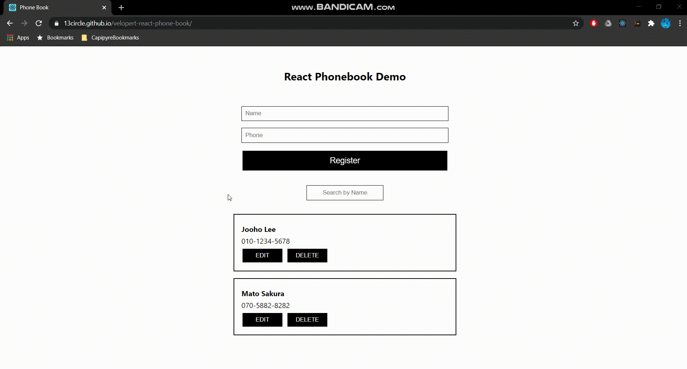

# velopert-react-phone-book

### 0. Purpose

- 간단한 연락처 관리자입니다.
- VELOPERT.LOG의 React Tutorial Ch.6~9까지의 종합 결과물입니다.

### 1. Features
- 이름과 전화번호를 입력한 후 등록하면 state에 저장 후 조회합니다.
- 조회된 연락처는 이름/전화번호 수정 및 연락처를 삭제할 수 있습니다.
- 이름으로 특정 연락처를 검색할 수 있습니다.

### 2. How to use
1. 이 repo의 <a href="https://13circle.github.io/velopert-react-phone-book/">GitHub Page</a>로 접속합니다.
2. 페이지 상단의 폼에 이름/전화번호를 입력한 후 Register를 누릅니다.
3. 등록된 연락처는 자동으로 조회됩니다.
4. 연락처의 EDIT을 클릭하면 수정 모드로 전환합니다.
   수정 후 SAVE를 클릭하면 저장됩니다.
5. 연락처의 DELETE를 클릭하면 해당 연락처가 삭제됩니다.

### 3. Development Stack
* React
    - React 기초 튜토리얼로서 순수 React만 활용하였습니다.